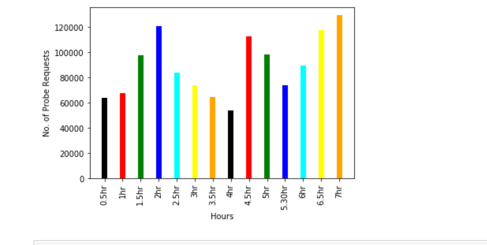
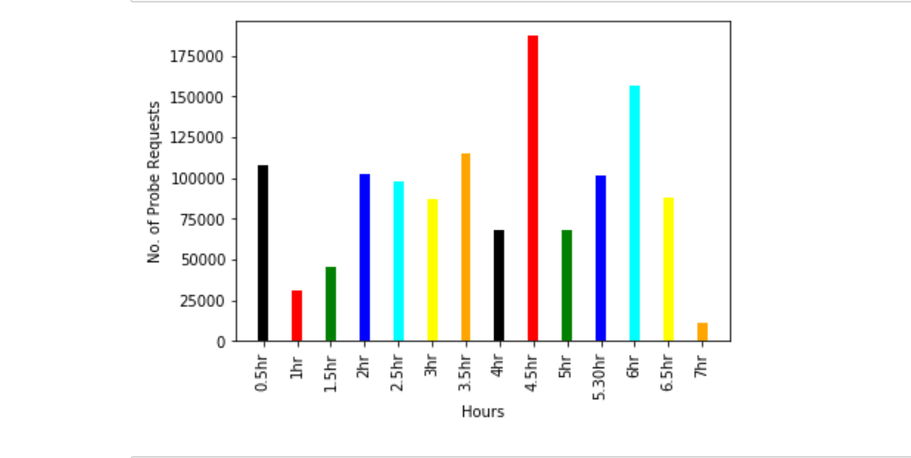
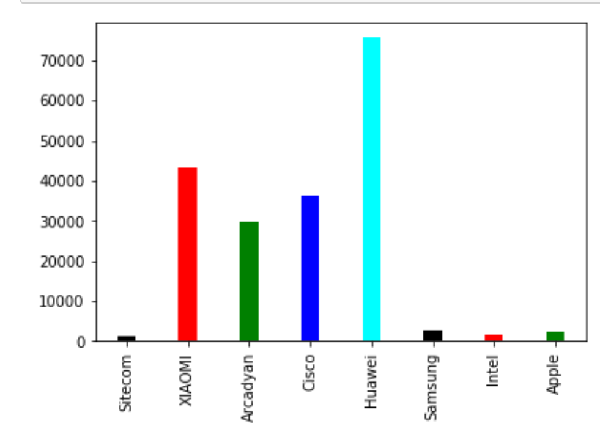

### Scenario at laundry of the building in the dormitory 

The device was kept at near a small area near the laundry of the student dormitory. In accordance to the previous measurement, probes scanning lasted for seven hours. I can see the list of manufacturers names and also the amount of probes

Insights

It is clearly evident that the no of probes request were increasing after 5 hours. This clearly indicates a maximum rush during the evening part of the day. It is evident that from the day of collection was Saturday and most student prefer to do laundry at the evening. It is also visible that no of probes were decreasing after 2 hours which was around 2pm suggesting that most of the student preferred to do some other activity apart from laundry such as lunch.

Since, laundry room is situated next to the actual shared apartment, the manufacturer Tp-Link requests were maximum as it one of non mobile device. It can be also observed that majority of students who used laundry used the phones such as Xiami, Huawei. Besides this, some other major manufacturers were cisco and tendatec. Since tendatec is an italian company with very less presence in germany, it can be also concluded with some probability that some part of population is associated with Italy

### Scenario at journey to U-bahn

The device was kept at near a small area near the laundry of the student dormitory. In accordance to the previous measurement, probes scanning lasted for seven hours. I can see the list of manufacturers names and also the amount of probes

Insights

It is clearly evident that the no of probes request were maximum at 4.30 hours. This clearly indicates a dense area during the travel. It was also concluded that it was time when i was travelling in crowded U-bahn. When I reached the destination which was less dense, the no of probes request dropped significantly. As I was returning, I can see that no of probes requests got in increasing mode.

It is also interesting observed that much of the travellers used the mobile devices manufactured by Huawei as it recorded highest no of probes. Also, this distribution tells about the preferences of people for mobile devices using the U-bahn6. Also most of these manufacturers hail from China, which is another interesting perspective of where most of people buy devices.

